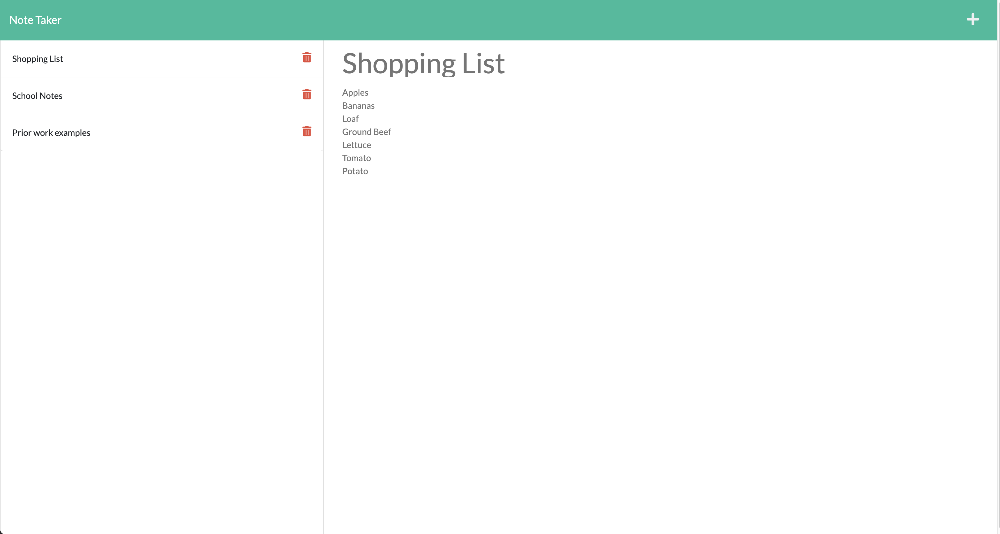

# Note Taker

## Heroku Deployed Link
https://ancient-hamlet-83595.herokuapp.com/

## Link to GitHub Repo
https://github.com/paksin/11-Express-Challenge

## Description
The challenge is to create an application called Note Taker that can be used to write and save notes. Furthermore, the ability to remove notes from the list is also added. This application will use an Express.js back end and will save and retrieve note data from a JSON file.

